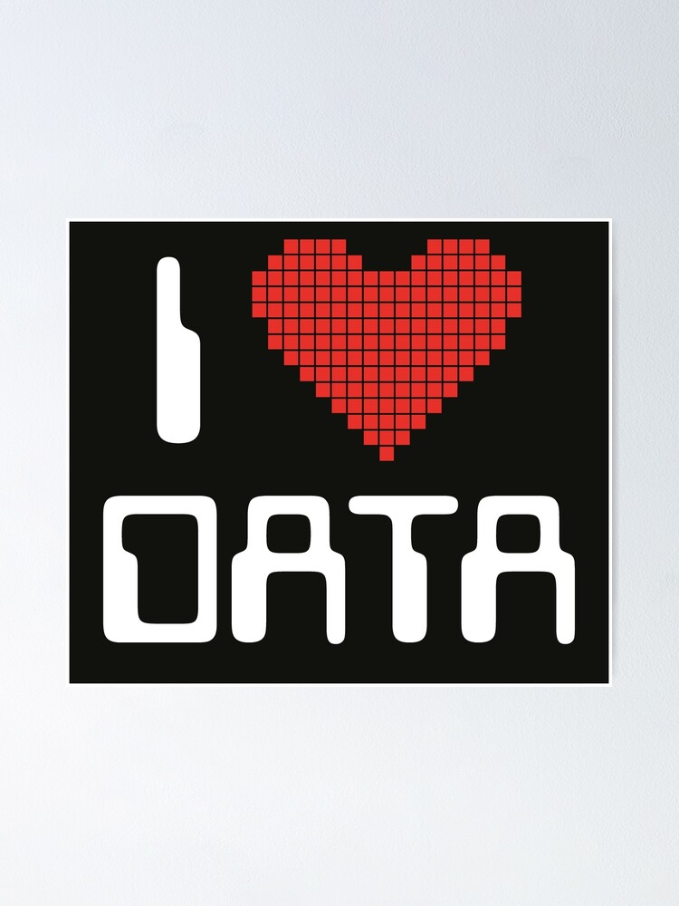

### Hi there 👋, I AM KOUSHAL 

Passionate about leveraging data to derive meaningful insights and solve complex problems. Experienced in machine learning, statistical analysis, and data visualization. Adept at translating business questions into data-driven solutions.

  

## Skills
- **Programming Languages:** Python (NumPy, Pandas, Scikit-Learn), R, SQL
- **Machine Learning:** Regression, Classification, Clustering, Neural Networks
- **Data Visualization:** Matplotlib, Seaborn, Plotly                                                                                                
- **Big Data Tools:** Hadoop, Spark
- **Database Systems:** MySQL, PostgreSQL, MongoDB
- **Version Control:** Git, GitHub
- **Tools & Platforms:** Jupyter Notebooks, Google Colab, Docker

- ## Contact

📧 Email: koushalyadavmudike@gmail.com  
📱 LinkedIn: www.linkedin.com/in/koushal-yadav-mudike

